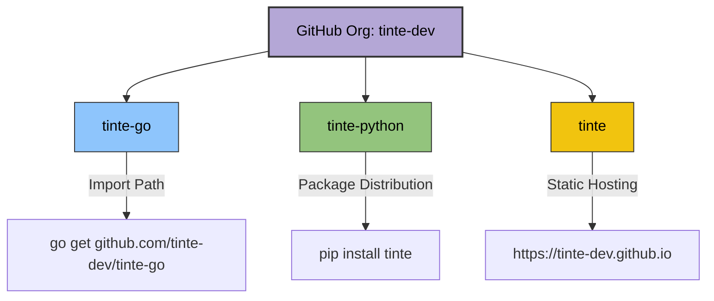

# tinte 🎨 Repository Separation Blueprint

이 문서는 단일 모노레포로 구성되어 있던 `tinte` 프로젝트를 전용 GitHub Organization `tinte-dev` 산하의 3개 독립 레포지토리로 분할하여 배포 및 유지보수를 극대화하기 위한 설계 명세서입니다.

---

## 🏗️ 1. 전체 아키텍처 및 레포지토리 구조



### 1) [tinte-go] Go 전용 모듈 레포지토리
* **경로**: `github.com/tinte-dev/tinte-go`
* **폴더 구조**:
```text
tinte-go/
├── .github/
│   └── workflows/
│       └── ci.yml
├── examples/
│   └── main.go
├── display.go
├── prompts.go
├── theme.go
├── spinner.go
├── terminal.go
├── ...
├── go.mod
├── LICENSE
└── README.md
```

### 2) [tinte-python] Python 전용 패키지 레포지토리
* **경로**: `github.com/tinte-dev/tinte-python`
* **폴더 구조**:
```text
tinte-python/
├── .github/
│   └── workflows/
│       ├── test.yml
│       └── publish.yml
├── src/
│   └── tinte/
│       ├── __init__.py
│       ├── intro_outro.py
│       ├── log.py
│       ├── spinner.py
│       ├── theme.py
│       ├── core/
│       ├── display/
│       └── prompts/
├── examples/
│   ├── demo_display.py
│   └── demo_prompts.py
├── pyproject.toml
├── LICENSE
└── README.md
```

### 3) [tinte] 공식 웹사이트 & 문서 통합 포털 레포지토리
* **경로**: `github.com/tinte-dev/tinte`
* **폴더 구조**:
```text
tinte/
├── docs/
│   ├── introduction.md
│   └── developer_guide.md
├── index.html        (현재 preview.html을 명칭 변경하여 배치)
├── LICENSE
└── README.md
```

---

## 🛠️ 2. 마이그레이션 단계별 로드맵 (초기화 빌드 방식)

기존 Git 커밋 히스토리를 배제하고 최신 빌드 스냅샷을 기반으로 각 레포지토리를 새롭게 초기화하는 가장 깨끗하고 안전한 작업 경로입니다.

### 1단계: GitHub Organization 및 레포지토리 개설
1. GitHub에서 `tinte-dev`라는 이름으로 무료 Organization을 개설합니다.
2. Organization 내에 `tinte-go`, `tinte-python`, `tinte` 3개의 비어있는 public 레포지토리를 생성합니다.

### 2단계: Go 전용 레포지토리 초기화 및 배포
로컬 터미널에서 아래 명령어를 차례로 수행합니다:
```bash
# 1. 임시 작업 디렉토리 생성 및 코드 복사
mkdir tinte-go-split
cp -r optimistic-bell/go/* tinte-go-split/
cd tinte-go-split

# 2. go.mod 수정 (루트 모듈 경로 변경)
# go.mod 파일의 첫 줄을 'module github.com/tinte-dev/tinte-go' 로 변경합니다.

# 3. 코드 내의 내부 임포트 경로 교정
# 프로젝트 소스 내의 "github.com/tinte-dev/tinte" 임포트 참조를 
# "github.com/tinte-dev/tinte-go" 로 전체 치환합니다.

# 4. Git 리포지토리 초기화 및 푸시
git init
git add .
git commit -m "Initial Commit: tinte-go core library"
git branch -M main
git remote add origin https://github.com/tinte-dev/tinte-go.git
git push -u origin main

# 5. 버전 태그 생성 및 배포 (모듈 인덱서 등록)
git tag v1.0.0
git push origin v1.0.0
```

### 3단계: Python 전용 레포지토리 초기화 및 배포
```bash
# 1. 임시 작업 디렉토리 생성 및 src 구조 복사
mkdir tinte-python-split
mkdir -p tinte-python-split/src
cp -r optimistic-bell/python/tinte tinte-python-split/src/
cp -r optimistic-bell/python/examples tinte-python-split/
cp optimistic-bell/python/pyproject.toml tinte-python-split/
cd tinte-python-split

# 2. pyproject.toml 수정
# 아래 패키지 릴리즈 명세 단락을 확인하여 패키지 버전을 1.0.0으로 동기화합니다.

# 3. Git 초기화 및 푸시
git init
git add .
git commit -m "Initial Commit: tinte-python library with src layout"
git branch -M main
git remote add origin https://github.com/tinte-dev/tinte-python.git
git push -u origin main
```

### 4단계: 공식 웹사이트 & 문서(GitHub Pages) 초기화 및 배포
```bash
# 1. 작업 디렉토리 생성
mkdir tinte-docs-split
cd tinte-docs-split

# 2. 문서 및 프리뷰 복사
mkdir docs
cp optimistic-bell/docs/introduction.md docs/
cp optimistic-bell/docs/developer_guide.md docs/
cp optimistic-bell/preview.html index.html

# 3. Git 초기화 및 푸시
git init
git add .
git commit -m "Initial Commit: Landing page website with EN/KO translations"
git branch -M main
git remote add origin https://github.com/tinte-dev/tinte.git
git push -u origin main
```
> [!IMPORTANT]
> GitHub Pages 설정: `github.com/tinte-dev/tinte` 레포지토리 설정(Settings) -> Pages 탭 진입 -> Build and deployment의 Source를 **Deploy from a branch**로 선택하고 Branch를 **`main / (root)`**로 지정한 뒤 저장합니다. 1~2분 후 `https://tinte-dev.github.io`에서 실시간 웹사이트가 서비스됩니다.

---

## 📦 3. 패키징 구성 명세 (Package Configs)

### Go 모듈 설정 (`tinte-go/go.mod`)
```go
module github.com/tinte-dev/tinte-go

go 1.21
```

### Python 패키지 설정 (`tinte-python/pyproject.toml`)
```toml
[build-system]
requires = ["hatchling"]
build-backend = "hatchling.build"

[project]
name = "tinte"
version = "1.0.0"
authors = [
    { name = "tinte Developers", email = "maintainers@tinte.dev" }
]
description = "A beautiful, themeable, ultra-lightweight terminal prompt and display library for Python and Go."
readme = "README.md"
requires-python = ">=3.10"
license = { text = "MIT" }
classifiers = [
    "Programming Language :: Python :: 3",
    "License :: OSI Approved :: MIT License",
    "Operating System :: OS Independent",
    "Topic :: Software Development :: User Interfaces",
]
dependencies = [
    "colorama>=0.4.6",
    "wcwidth>=0.2.13",
]

[tool.hatch.build.targets.wheel]
packages = ["src/tinte"]
```

---

## 🚀 4. CI/CD 자동화 파이프라인 (GitHub Actions)

### 1) Python: 테스트 검증 및 PyPI 배포 워크플로우

이 워크플로우는 코드가 병합될 때 단위 테스트를 검증하고, 새 배포 태그(`v*`)가 찍힐 때 자동으로 PyPI로 패키지를 배포합니다.

#### 파일 경로: `tinte-python/.github/workflows/publish.yml`
```yaml
name: Python Package CI/CD

on:
  push:
    branches: [ main ]
    tags: [ 'v*' ]
  pull_request:
    branches: [ main ]

jobs:
  test:
    runs-on: ubuntu-latest
    steps:
    - uses: actions/checkout@v4
    - name: Set up Python
      uses: actions/setup-python@v5
      with:
        python-version: '3.10'
    - name: Install dependencies
      run: |
        python -m pip install --upgrade pip
        pip install flake8 pytest build
        pip install -e .
    - name: Lint with flake8
      run: |
        # Stop build if there are syntax errors
        flake8 src/tinte --count --select=E9,F63,F7,F82 --show-source --statistics
    - name: Run tests
      run: |
        # If test suite is configured, run pytest
        pytest --maxfail=1 --disable-warnings -v || echo "No tests configured yet"

  publish:
    needs: test
    if: startsWith(github.ref, 'refs/tags/v')
    runs-on: ubuntu-latest
    permissions:
      id-token: write  # Trusted Publishing(OIDC) 인증 필수 설정
    steps:
    - uses: actions/checkout@v4
    - name: Set up Python
      uses: actions/setup-python@v5
      with:
        python-version: '3.10'
    - name: Build binary wheels
      run: python -m build
    - name: Publish package to PyPI
      uses: pypa/gh-action-pypi-publish@release/v1
```

### 2) Go: 포맷 및 빌드 검증 워크플로우

#### 파일 경로: `tinte-go/.github/workflows/ci.yml`
```yaml
name: Go Modules CI

on:
  push:
    branches: [ main ]
  pull_request:
    branches: [ main ]

jobs:
  build-and-test:
    runs-on: ubuntu-latest
    steps:
    - uses: actions/checkout@v4
    - name: Set up Go
      uses: actions/setup-go@v5
      with:
        go-version: '1.21'
    - name: Check code formatting
      run: |
        if [ -n "$(gofmt -l .)" ]; then
          echo "Go code is not formatted properly. Please run 'gofmt -w .'"
          exit 1
        fi
    - name: Build validation
      run: go build -v ./...
    - name: Run tests
      run: go test -v ./... || echo "No unit tests created yet"
```
